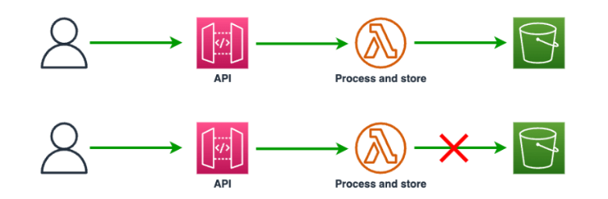

## Storage first approach

Storage-First is one of the patterns I use the most. I would say that there is not a single architecture that I have designed that doesn't take advantage of this. Just as then name suggest this pattern is all about storing / capturing incoming request/data using AWS managed services. This is a strong pattern if no data is needed to be returned from the API.

By storing the data we have an exact copy in case of our processing fails. Examples of failures could be, but not limited to.

Failure to process the data  
Failure storing the data to persisting storage  
Failure when calling a downstream 3rd party service or API.  

This is standard way to handle requests using Amazon API Gateway where we like to process the incoming request and store the data in Amazon S3, it could look something like this.  

Let's start with the High Level Design.

If the AWS Lambda function now fail to process the data, is lacking permissions to call Amazon S3 or any other failure, the data would be lost. The client would get an 4XX error back and would need to retry calling the API. This can become some very complex logic in the client and can be very frustrating. Instead our API implementation could handle this problem with the Storage-First approach, that would then look something like this.

The request and data would be stored in Amazon SQS using a service integration in API Gateway, and even if our Lambda functions fail the request is secure in SQS and can be processed again later.